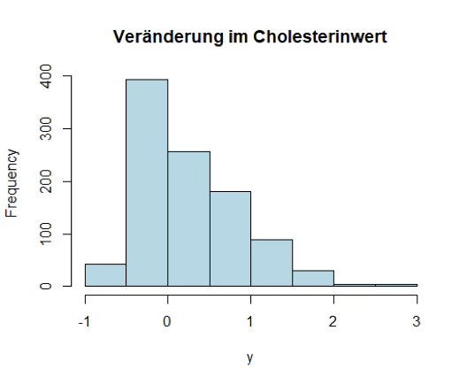
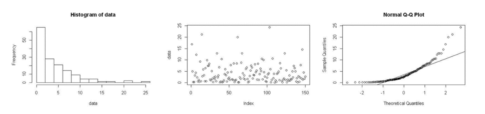

```{r, echo = FALSE, results='asis'}
library(webexercises)
```

<small style="color: gray;">**Hinweis:** Runden Sie das Ergebnis wenn nötig, auf zwei Nachkommastellen. </small>

### Übungen 1 – A1

### Aufgabe 1
In der Normalbevölkerung gesunder Erwachsener ist der Hämoglobinwert bei Männern im Mittel bei 14.0 g/dl mit Standardabweichung 1.8 g/dl.

::: {.webex-check .webex-box}
```{r, results='asis', echo=FALSE}
opts <- c(
  "$P(X > 16) = 0.87$",
  "$P(X > 16) = 0.50$",
  answer = "$P(X > 16) = 0.13$"
)
cat("(a) Wie groß ist der Anteil in der männlichen Bevölkerung mit einem Hämoglobinwert über 16.0 g/dl?",
  longmcq(opts))
```
:::
::: {.callout-tip collapse="true" title="Lösung"}
(a) Der Anteil ist $P(X > 16) = 0.13$. Rechnung:
$$P(X > 16) = 1 - P(X \leq 16) = 1 - P\left(Z \leq \frac{16 - 14}{1.8}\right)$$ $$= 1 - P(Z \leq 1.11) = 1 - 0.8665 = 0.13$$
:::

::: {.webex-check .webex-box}
```{r, results='asis', echo=FALSE}
opts <- c(
  "$X \\leq 12.50$",
  "$X \\leq 14.00$",
  answer = "$X \\leq 11.04$"
)
cat("(b) Welches ist die untere Hämoglobinwertgrenze für Personen, die zu der Gruppe mit den 5% niedrigsten Hämoglobinwerten gehören?",
  longmcq(opts))
```
:::
::: {.callout-tip collapse="true" title="Lösung"}
(b) Die Grenze ist 11.04. Rechnung: Betrachte $z_{0.05} \rightarrow P(Z \leq -1.645)$. Z in X transformieren:
$$X \leq -1.645 \cdot 1.8 + 14 = 11.04$$
:::

### Aufgabe 2

::: {.webex-check .webex-box}
```{r, results='asis', echo=FALSE}
cat("a) Welche der folgenden Aussagen sind richtig? <br><br>(**Hinweis:** Mehrere Aussagen können richtig sein.) <br><br>")

cat("**1.** Die Binomialverteilung ist die Grenzverteilung der Normalverteilung. <br>")
cat(mcq(c(answer = "Falsch", "Richtig")), "<br><br>")

cat("**2.** Die Binomialverteilung beschreibt die Anzahl der Erfolge in einer Serie von unabhängigen Versuchen. <br>")
cat(mcq(c("Falsch", answer = "Richtig")), "<br><br>")

cat("**3.** Der Zentrale Grenzwertsatz greift, wenn $n$ gegen $0$ konvergiert. <br>")
cat(mcq(c(answer = "Falsch", "Richtig")), "<br><br>")

cat("**4.** Um den t-Test anwenden zu können, muss vorher immer ein Test auf Normalverteilung durchgeführt werden. <br>")
cat(mcq(c(answer = "Falsch", "Richtig")), "<br><br>")

cat("**5.** Voraussetzung für den Zentralen Grenzwertsatz ist, dass $X_1, X_2, \\ldots, X_n$ eine Folge von unabhängig und identisch verteilten Zufallsvariablen ist. <br>")
cat(mcq(c("Falsch", answer = "Richtig")), "<br><br>")
```
:::

::: {.callout-tip collapse="true" title="Lösung"}
a) **Richtig: Nr. 2 und Nr. 5** <br>

	**Erklärungen:**

	1. Falsch – Die Normalverteilung ist die Grenzverteilung der Binomialverteilung.
	2. Richtig.
	3. Falsch – Der Grenzwertsatz greift, wenn $n \rightarrow \infty$ konvergiert.
	4. Falsch – Ein Vortest auf Normalverteilung ist nicht immer zu empfehlen.
	5. Richtig.
:::


### Aufgabe 3
Sie interessieren sich für die Veränderung im Cholesterinwert nach einer speziellen Diät. Folgende Verteilung der Daten beobachten Sie (n=50)

 <br><br>

::: {.webex-check .webex-box}
```{r, results='asis', echo=FALSE}
opts <- c(
  "Die Daten sind normalverteilt.",
  "Die Verteilung ist multimodal.",
  answer = "Die Daten sind schief verteilt.",
  "Die Daten sind normalverteilt mit deutlichen Ausreißern."
)
cat("(a) Welche Aussage bezüglich der Verteilung passt am besten?",
  longmcq(opts))
```
:::
::: {.callout-tip collapse="true" title="Lösung"}
(a) Die Daten sind schief verteilt (rechtsschief bzw. linkssteil).
:::

::: {.webex-check .webex-box}
```{r, results='asis', echo=FALSE}
opts <- c(
  "Ja",
  answer = "Nein"
)
cat("(b) Ist hier eine logarithmische Transformation sinnvoll?",
  longmcq(opts))
```
:::
::: {.callout-tip collapse="true" title="Lösung"}
(b) Nein, weil y < 0 beobachtet wird und damit nicht definiert.
:::

::: {.webex-check .webex-box}
```{r, results='asis', echo=FALSE}
cat("(c) Sie möchten die Veränderung im Cholesterinwert zwischen der Gruppe mit der speziellen Diät und einer Kontrollgruppe (\"normale\" Diät) in einer randomisierten Studie vergleichen. Die Fallzahl pro Gruppe beträgt n=15. Wie planen Sie die statistische Analyse? <br><br>
  (**Hinweis:** Mehrere Aussagen können richtig sein.) <br><br>
  **1.** Ich wende den z-Test an. <br>")
cat(mcq(c(answer = "Falsch", "Richtig")), "<br><br>")

cat("**2.** Ich wende den t-Test und den z-Test an und vergleiche die Ergebnisse. Stimmen die Ergebnisse überein, dann ist der t-Test valide. <br>")
cat(mcq(c(answer = "Falsch", "Richtig")), "<br><br>")

cat("**3.** Ich wähle einen nichtparametrischen Test und berichte Median mit Interquartilsabstand. <br>")
cat(mcq(c("Falsch", answer = "Richtig")), "<br><br>")

cat("**4.** Ich nehme den t-Test, falls die Daten normalverteilt sind, und einen nichtparametrischen Test, falls die Daten schief verteilt sind. Dazu teste ich vorher auf Normalverteilung. <br>")
cat(mcq(c(answer = "Falsch", "Richtig")), "<br><br>")

cat("**5.** Ich schaue die Verteilung der Daten grafisch an (z.B. Histogramm) und berichte beides: Median mit Interquartilsabstand sowie Mittelwert mit Standardabweichung stratifiziert nach Gruppe. <br>")
cat(mcq(c("Falsch", answer = "Richtig")), "<br><br>")

cat("**6.** Ich logarithmiere die Daten und wende dann den t-Test an. <br>")
cat(mcq(c(answer = "Falsch", "Richtig")), "<br><br>")
```
:::
::: {.callout-tip collapse="true" title="Lösung"}
(c) **Richtig: Nr. 3 und Nr. 5**

	Wir haben gesehen, dass die Daten schief verteilt angenommen werden können (aus vorheriger Stichprobe, siehe Aufgabe a). 
	Eine logarithmische Transformation ist nicht sinnvoll, da y < 0 vorkommen kann. Zudem ist die Fallzahl pro Gruppe eher 
	im unteren Bereich. Daher würde man hier empfehlen, einen nichtparametrischen Test für den Gruppenvergleich anzuwenden. 
	Zudem würde man die Verteilung der Daten grafisch darstellen und Median mit Interquartilsabstand berichten. Mittelwert mit 
	Standardabweichung kann zusätzlich berichtet werden.
:::


### Aufgabe 4

Frau Dr. Schmidt, Leiterin einer Arztpraxis auf dem Land, möchte in ihrer Praxis die Bereitschaft zur 
Organspende untersuchen. Sie rechnet damit, dass Sie innerhalb der nächsten 4 Woche 57 Patienten dazu befragen kann. 
Erfahrungsgemäß liegt die Bereitschaft zur Organspende bei einer Wahrscheinlichkeit von 80%.

Aufgrund der dörflichen Lage ihrer Praxis und damit großen Entfernungen zu größeren Kliniken ist Dr. Schmidt auf Organspenden ihrer 
eigenen Patienten angewiesen. Daher ist sie an der Wahrscheinlichkeit interessiert, 
dass von den 57 Patienten mindestens 55 Patienten der Organspende zustimmen

::: {.webex-check .webex-box}
(a) Welcher Verteilung folgt die Bereitschaft zur Organspende?<br> N = Normalverteilung, Bin = Binomialverteilung
```{r, results='asis', echo=FALSE}
opts <- c("$N(0,1)$", answer = "$Bin(n,p)$", "$N(57, 4)$", "$Bernoulli(p)$", "$N(\\mu, 4)$")
cat(longmcq(opts))
```
:::

::: {.callout-tip collapse="true" title="Lösung"}
(a) Dies ist eine **Binomialverteilung**. Es gibt zwei mögliche Ausgänge (Bereitschaft = ja oder nein) und eine feste Anzahl an Versuchen (hier 57 Patienten).
:::

::: {.webex-check .webex-box}
```{r, results='asis', echo=FALSE}
cat("(b) Welche zwei Möglichkeiten gibt es diese Wahrscheinlichkeit zu berechnen? <br><br>
	1. Exakte Berechnung über die ...", fitb("Binomialverteilung", ignore_case = TRUE)," <br><br>
	2. Approximative Berechnung über die ... ", fitb("Normalverteilung", ignore_case = TRUE))
```
:::

::: {.callout-tip collapse="true" title="Lösung"}

(b) Es gibt zwei Möglichkeiten:<br>
	**1. Exakte Berechnung**
	Berechnung über die **Binomialverteilung** (Summe über Einzelwahrscheinlichkeiten).

	**2. Approximative Berechnung**
	Berechnung über die **Normalverteilung** unter der Voraussetzung, dass $n \cdot p \cdot (1-p) > 9$.
:::

::: {.webex-check .webex-box}
```{r, results='asis', echo=FALSE}
opts <- c(
  answer = "Ja",
  "Nein"
)
cat("(c) Ist die Voraussetzung für den zweiten Ansatz hier erfüllt?",
  longmcq(opts))
```
:::
::: {.callout-tip collapse="true" title="Lösung"}
(c) Ja, sie ist erfüllt. Die Voraussetzung für eine Normalapproximation ist $n \cdot p \cdot (1-p) > 9$. Es gilt:
$$n \cdot p \cdot (1-p) = 57 \cdot 0.8 \cdot 0.2 = 9.12 > 9$$
:::


### Aufgabe 5

Gegeben sind folgende Daten (dargestellt durch Histogram, Streudiagramm und Q-Q-Plot):

 <br><br>

::: {.webex-check .webex-box}
```{r, results='asis', echo=FALSE}
opts <- c(
  answer = " <br>",
  " <br>",
  " <br>"
)
cat("(a) Welcher Boxplot passt zu den Daten oben? <br><br>",
  longmcq(opts))
```
:::

::: {.callout-tip collapse="true" title="Lösung"}
a) A ist richtig. Die Daten sind schief verteilt und liegen in einem Range von 0–25.
:::
