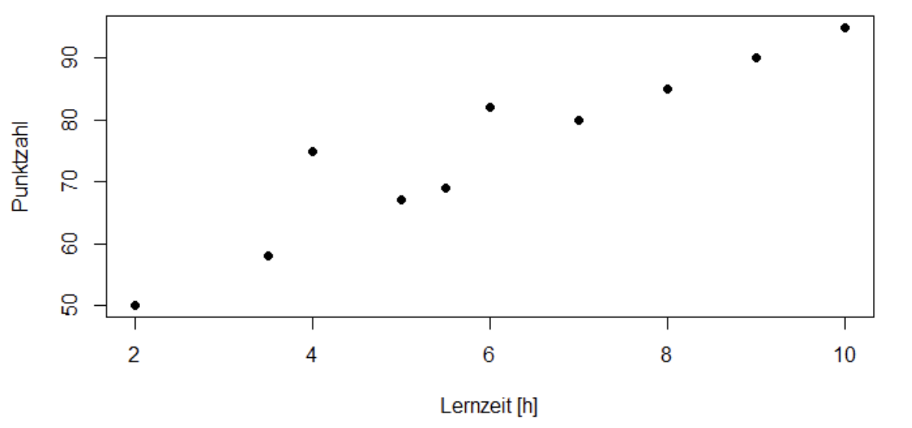

```{r, echo = FALSE, results='asis'}
library(webexercises)
```


## Block 8 Lineare Regression

<small style="color: gray;">**Hinweis:** Runden Sie das Ergebnis wenn nötig, auf zwei Nachkommastellen und verwenden Sie als Dezimaltrennzeichen den Punkt (Bsp.: $5.24$)</small>

### Aufgabe 1

Bei **10 Studierenden** wurde die **Lernzeit (in Stunden)** für eine Klausur sowie die **erreichte Punktzahl (von 100 Punkten)** erfasst. Untersucht werden soll der lineare Zusammenhang zwischen Lernzeit und Klausurpunktzahl.<br> Folgende Daten wurden beobachtet
($\bar{x} = \text{Mittelwert}, s = \text{Standardabweichung}$)

| Teilnehmer | $s_1$ | $s_2$ | $s_3$ | $s_4$ | $s_5$ | $s_6$ | $s_7$ | $s_8$ | $s_9$ | $s_{10}$ | $\bar{x}$ | $s$ |
|---|---:|---:|---:|---:|---:|---:|---:|---:|---:|---:|---:|---:|
| Lernzeit (h) | 3.5 | 5 | 4 | 7 | 6 | 8 | 2 | 9 | 5.5 | 10 | 6.0 | 2.5 |
| Punktzahl | 58 | 67 | 75 | 80 | 82 | 85 | 50 | 90 | 69 | 95 | 75.1 | 14.2 |

::: {.webex-check .webex-box}
```{r, results='asis', echo=FALSE}
cat("(a) Entscheiden Sie, welches Merkmal die Einflussgröße und welches Merkmal die Zielgröße ist. <br><br>
  Einflussgröße: ", fitb("Lernzeit", ignore_case = TRUE), "<br>
  Zielgröße: ", fitb("Punktzahl", ignore_case = TRUE))
```
:::

::: {.callout-tip collapse="true" title="Lösung"}
(a) 

**Einflussgröße (unabhängige Variable):** Lernzeit (X)

**Zielgröße (abhängige Variable):** Punktzahl (Y)

Die Lernzeit beeinflusst die erreichter Punktzahl, nicht umgekehrt.

:::

::: {.webex .webex-box}
(b) Erstellen Sie eine Punktwolke (Scatterplot) und beurteilen Sie diese hinsichtlich: Linearität, mögliche Ausreißer, Auffälligkeiten.
:::

::: {.callout-tip collapse="true" title="Lösung"}
(b)  <br> <br>
	- **Linearität:** Es scheint einen linearen Zusammenhang zu geben. Je größer die Lernzeit desto höher die Punktzahl. <br>
	- **Ausreißer/Auffälligkeiten:** Keine direkten Ausreißer erkennbar. Durch die kleine Stichprobe ist der beobachtete Zusammenhang mit viel Unsicherheit behaftet.
:::


::: {.webex-check .webex-box}
```{r, results='asis', echo=FALSE}
cat("(c) Berechnen Sie den Korrelationskoeffizienten nach Pearson (Die Kovarianz ist $s_{xy} = 33.7$). <br>
  Geben Sie das Ergebnis auf zwei Nachkommastellen an.<br>
	<small style=\"color: gray;\">(den Wert auf zwei Nachkommastellen runden)</small><br>
	<br> $r =$ ", fitb(0.94, tol = 0.01))
```
:::

::: {.callout-tip collapse="true" title="Lösung"}
(c) Der Korrelationskoeffizient nach Pearson wird berechnet mit:

$$r = \frac{s_{xy}}{s_x \cdot s_y} = \frac{33.7}{2.5 \cdot 14.2} = 0.94$$

:::

::: {.webex-check .webex-box}
```{r, results='asis', echo=FALSE}
cat("(d) Bestimmen Sie die Regressionsgerade: $\\ y = \\hat{\\alpha} + \\hat{\\beta}x$ <br>
  <small style=\"color: gray;\">(den Wert auf zwei Nachkommastellen runden)</small><br> <br>
  Steigung $\\hat{\\beta} =$", fitb(5.39, tol = 0.01)," <br> <br>
  Intercept $\\hat{\\alpha} =$", fitb(42.75, tol = 0.1))
```
:::

::: {.callout-tip collapse="true" title="Lösung"}
(d) Die Parameter der Regressionsgeraden werden berechnet mit:

$$\hat{\beta} = \frac{s_{xy}}{s_x^2} = \frac{33.7}{2.5^2} = 5.39$$

$$\hat{\alpha} = \bar{y} - \hat{\beta} \cdot \bar{x} = 75.1 - 5.39 \cdot 6.0 = 42.75$$

**Regressionsgerade:** $\hat{y} = 42.75 + 5.39x$

:::

::: {.webex .webex-box}
(e) Interpretieren Sie den Regressionskoeffizienten (Steigung der Regressionsgerade).
:::

::: {.callout-tip collapse="true" title="Lösung"}
(e) Der Regressionskoeffizient (Steigung) gibt die mittlere Änderung in $Y$ an, wenn $X$ um eine Einheit ansteigt. 
	Hier ist es somit, dass die Punktzahl im Mittel um $5.39$ Punkte steigt, wenn man 1h mehr lernt.


:::

::: {.webex-check .webex-box}
```{r, results='asis', echo=FALSE}
cat("(f) Berechnen Sie für eine Lernzeit von $6.5$ Stunden die erwartete Punktzahl. 
 <br><small style=\"color: gray;\">(den Wert auf eine Nachkommastellen runden)</small><br> <br>
  Erwartete Punktzahl = ", fitb(77.8, tol = 0.1))
```
:::

::: {.callout-tip collapse="true" title="Lösung"}
(f) $$ y = 42.75 + 5.39 \cdot 6.5 = 42.75 + 35.04 = 77.8$$
	Für eine Lernzeit von 6.5 Stunden wird eine erwartete Punktzahl von **77.8 Punkten** prognostiziert.

:::

::: {.webex-check .webex-box}
```{r, results='asis', echo=FALSE}
cat("(g) Bestimmen Sie das Bestimmtheitsmaß $R^2$ und interpretieren Sie dessen Bedeutung.<br>
	<small style=\"color: gray;\">(den Wert auf zwei Nachkommastellen runden)</small><br> <br>
	$R^2 =$", fitb(0.88, tol = 0.01))
```
:::

::: {.callout-tip collapse="true" title="Lösung"}
(g) Das Bestimmtheitsmaß wird berechnet mit:

	$$R^2 = 0.94^2 = 0.88$$

	**Interpretation:** $88\%$ der Varianz in Y wird durch X erklärt.

:::

::: {.webex .webex-box}
(h) Ist die lineare Regression für diese Daten geeignet? Begründen Sie Ihre Antwort anhand der Punktwolke und der berechneten Kennzahlen.
:::

::: {.callout-tip collapse="true" title="Lösung"}
(h) **Begründung:** Es scheint einen positiven, linearen, starken Zusammenhang zu geben. <br>
	Einschränkend zu sagen ist, dass die Fallzahl sehr klein ist und sich der Zusammenhang auf die beobachtete Zeitspanne für 
	X = Lernzeit von 2 bis 10 Stunden bezieht. <br>
	Darüber hinaus kann keine Aussage getroffen werden. 


:::

### Aufgabe 2

::: {.webex-check .webex-box}
```{r, results='asis', echo=FALSE}
cat("(a) Welche der folgenden Aussagen sind korrekt?<br><br>")
	cat("**1.** Die Korrelation ist ein Maß für die Stärke der Übereinstimmung von zwei Merkmalen.<br>")
	cat(mcq(c(answer = "Falsch", "Richtig")), "<br><br>")

	cat("**2.** Der Bland Altman Plot eignet sich die Übereinstimmung von zwei Merkmalen zu veranschaulichen.<br>")
	cat(mcq(c("Falsch", answer = "Richtig")), "<br><br>")

	cat("**3.** Ein kausaler Zusammenhang (Ursache-Wirkungs-Beziehung) ist durch eine Korrelationsanalyse nachweisbar.<br>")
	cat(mcq(c(answer = "Falsch", "Richtig")), "<br><br>")

	cat("**4.** Die Korrelationsanalyse untersucht die Richtung und die Stärke des Zusammenhangs von Merkmalen.<br>")
	cat(mcq(c("Falsch", answer = "Richtig")), "<br><br>")
```
:::

::: {.callout-tip collapse="true" title="Lösung"}

(h) **Richtig: 2 + 4**
:::
