```{r, echo = FALSE, results='asis'}
library(webexercises)
```

## Deskriptive Statistik

<small style="color: gray;">**Hinweis:** Verwenden Sie bei Ergebnissen mit Nachkommastellen 
als Dezimaltrennzeichen den Punkt (Bsp.: $5.24$)</small>

### Übungen 8 – A1.1

::: {.webex-check .webex-box}
```{r, results='asis', echo=FALSE}
opts_nominal <- c(
	answer = "Nominalskala",
	"Ordinalskala",
	"Intervallskala",
	"Verhältnisskala"
)

opts_ordinal <- c(
	"Nominalskala",
	answer = "Ordinalskala",
	"Intervallskala",
	"Verhältnisskala"
)

opts_verhaeltnis <- c(
	"Nominalskala",
	"Ordinalskala",
	"Intervallskala",
	answer = "Verhältnisskala"
)
cat("(a) Bestimmen Sie das Skalenniveau der folgenden Merkmale:<br><br>")
cat("**1.** Augenfarbe: ", mcq(opts_nominal), "<br><br>")
cat("**2.** Telefonnummern: ", mcq(opts_nominal), "<br><br>")
cat("**3.** Anzahl Operationen pro Monat: ", mcq(opts_verhaeltnis), "<br><br>")
cat("**4.** Tumorausdehnung (mm): ", mcq(opts_verhaeltnis), "<br><br>")
cat("**5.** Blutdruck: ", mcq(opts_verhaeltnis), "<br><br>")
cat("**6.** Schmerzen (gering, mittel, hoch): ", mcq(opts_ordinal), "<br><br>")
cat("**7.** Intelligenzquotient: ", mcq(opts_ordinal))
```
:::

::: {.callout-tip collapse="true" title="Lösung"}
(a) <br> 
	1. Augenfarbe $\rightarrow$ Nominalskala
	2. Telefonnummern $\rightarrow$ Nominalskala
	3. Anzahl Operationen pro Monat $\rightarrow$ Verhältnisskala
	4. Tumorausdehnung (mm) $\rightarrow$ Verhältnisskala
	5. Blutdruck $\rightarrow$ Verhältnisskala
	6. Schmerzen (gering, mittel, hoch) $\rightarrow$ Ordinalskala
	7. Intelligenzquotient $\rightarrow$ Ordinalskala
:::

### Übungen 8 – A1.2

::: {.webex-check .webex-box}
(a) Es wird eine Studie geplant, bei dem die Wirkung eines Medikaments auf den 
	systolischen Blutdruck bei der Hypertonie untersucht werden soll. 

	**Ordnen Sie den Begriffen die entsprechenden Oberbegriffe zu.**

	**Begriffe:**

	1. Patient Müller
	2. 180 mmHg
	3. Blutdruck
	4. Menge aller hypertonen Patienten
	5. Hypertonie

	**Oberbegriffe:**

	a. Beobachtungseinheit
	b. Grundgesamtheit
	c. Merkmal
	d. Ausprägung

	```{r, results='asis', echo=FALSE}
	opts_beobachtungseinheit <- c(
		answer = "Beobachtungseinheit",
		"Grundgesamtheit",
		"Merkmal",
		"Ausprägung",
		"kein passender Oberbegriff"
	)

	opts_auspraegung <- c(
		"Beobachtungseinheit",
		"Grundgesamtheit",
		"Merkmal",
		answer = "Ausprägung",
		"kein passender Oberbegriff"
	)

	opts_merkmal <- c(
		"Beobachtungseinheit",
		"Grundgesamtheit",
		answer = "Merkmal",
		"Ausprägung",
		"kein passender Oberbegriff"
	)

	opts_grundgesamtheit <- c(
		"Beobachtungseinheit",
		answer = "Grundgesamtheit",
		"Merkmal",
		"Ausprägung",
		"kein passender Oberbegriff"
	)

	opts_keiner <- c(
		"Beobachtungseinheit",
		"Grundgesamtheit",
		"Merkmal",
		"Ausprägung",
		answer = "kein passender Oberbegriff"
	)

	cat("<br><strong>Wählen Sie zu jedem Begriff den passenden Oberbegriff:</strong><br><br>")
	cat("**1.** Patient Müller: ", mcq(opts_beobachtungseinheit), "<br><br>")
	cat("**2.** 180 mmHg: ", mcq(opts_auspraegung), "<br><br>")
	cat("**3.** Blutdruck: ", mcq(opts_merkmal), "<br><br>")
	cat("**4.** Menge aller hypertonen Patienten: ", mcq(opts_grundgesamtheit), "<br><br>")
	cat("**5.** Hypertonie: ", mcq(opts_keiner))
	```
:::

::: {.callout-tip collapse="true" title="Lösung"}
(a) <br> 
	1. Patient Müller $\rightarrow$ Beobachtungseinheit 
	2. 180 mmHg $\rightarrow$ Ausprägung
	3. Blutdruck $\rightarrow$ Merkmal
	4. Menge aller hypertonen Patienten $\rightarrow$ Grundgesamtheit
	5. Hypertonie $\rightarrow$ kein passender Oberbegriff aus der Liste
:::

### Übungen 8 – A1.3

::: {.webex-check .webex-box}


```{r, results='asis', echo=FALSE}
opts_qualitativ <- c(
	answer = "qualitativ",
	"quantitativ"
)

opts_quantitativ <- c(
	"qualitativ",
	answer = "quantitativ"
)
cat("(a) Welche der folgenden Merkmale sind qualitativ und welche quantitativ? <br><br>")
cat("**1.** Herzfrequenz: ", mcq(opts_quantitativ), "<br><br>")
cat("**2.** Schlaganfall: ", mcq(opts_qualitativ), "<br><br>")
cat("**3.** Blutgruppe: ", mcq(opts_qualitativ), "<br><br>")
cat("**4.** Zufriedenheit: ", mcq(opts_qualitativ), "<br><br>")
cat("**5.** BMI: ", mcq(opts_quantitativ), "<br><br>")
cat("**6.** Nüchternblutzucker: ", mcq(opts_quantitativ), "<br><br>")
cat("**7.** Infektion: ", mcq(opts_qualitativ))
```
:::

::: {.callout-tip collapse="true" title="Lösung"}
(a) **Qualitativ:**

	**2.** Schlaganfall (ja/nein) <br>
	**3.** Blutgruppe (A, B, AB, 0) <br>
	**4.** Zufriedenheit (z.B. niedrig, mittel, hoch)<br>
	**7.** Infektion (ja/nein)<br>

	**Quantitativ:**

	**1.** Herzfrequenz<br>
	**5.** BMI<br>
	**6.** Nüchternblutzucker<br>
:::

## Lage- und Streuungsmaße

### Übungen 8 – A2.1

::: {.webex-check .webex-box}
(a) Bestimmen Sie **Mittelwert** und **Median** der folgenden Cholesterinwerte (mg/dl):

	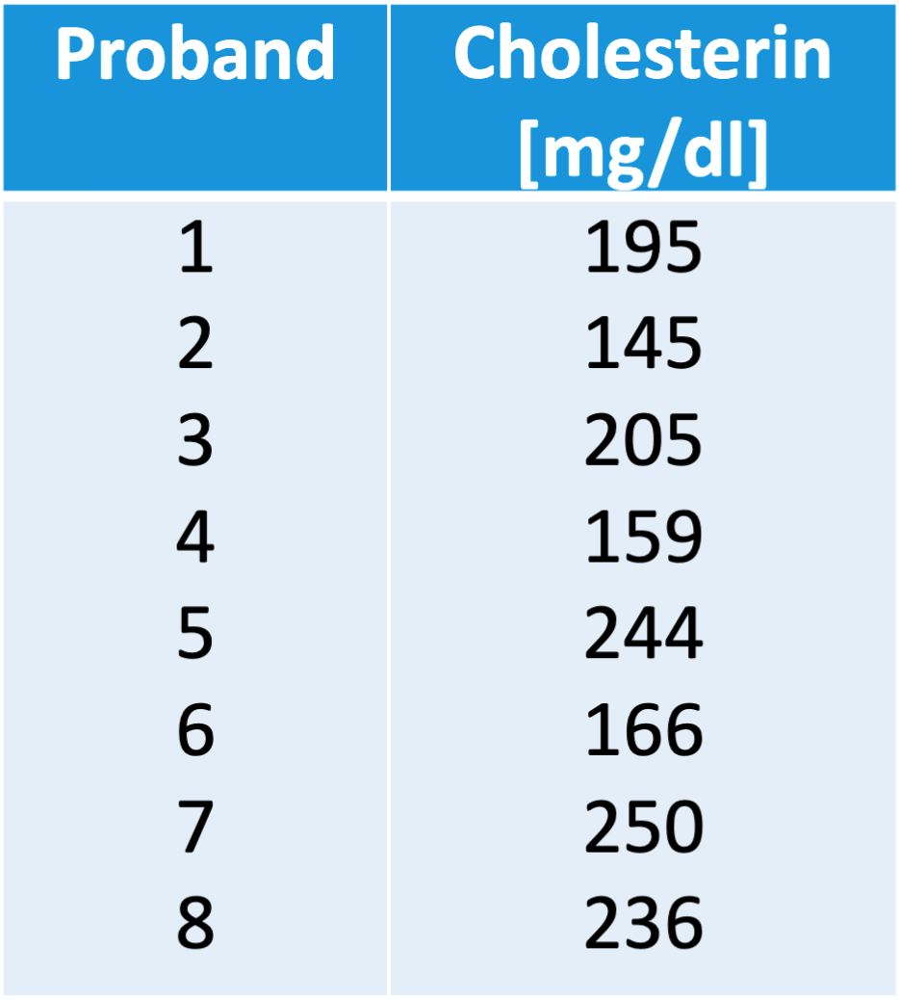 <br>

	Wie ändern sich **Mittelwert** und **Median**, wenn ein 9ter Proband mit einem Cholesterinwert von 110 mg/dl dazukommt?

	```{r, results='asis', echo=FALSE}
	cat("<br>Für <strong>n = 8</strong>:<br>")
	cat("Mittelwert: ", fitb("200", num = TRUE), "<br>")
	cat("Median: ", fitb("200", num = TRUE), "<br><br>")
	cat("Für <strong>n = 9</strong>:<br>")
	cat("Mittelwert: ", fitb("190", num = TRUE), "<br>")
	cat("Median: ", fitb("195", num = TRUE))
	```
:::

::: {.callout-tip collapse="true" title="Lösung"}
(a) Für $n=8$:

	$$
	\bar{x} = \frac{1}{8}(195 + 145 + 205 + 159 + 244 + 166 + 250 + 236) = 200
	$$

	Geordnet: $145, \;159, \;166, \;195, \;205, \;236, \;244, \;250$

	$$
	\tilde{x} = \frac{1}{2}(x_{(4)} + x_{(5)}) = \frac{1}{2}(195 + 205) = 200
	$$

	Mit dem zusätzlichen Wert $110$ gilt für $n=9$:

	$$
	\bar{x} = \frac{1}{9}(195 + 145 + 205 + 159 + 244 + 166 + 250 + 236 + 110) = 190
	$$

	Geordnet: $110, \;145, \;159, \;166, \;195, \;205, \;236, \;244, \;250$

	$$
	\tilde{x} = x_{(5)} = 195
	$$

	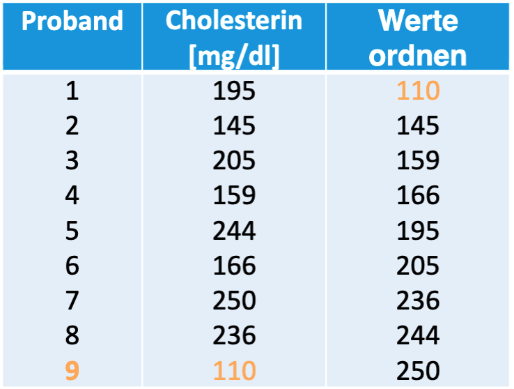 
:::

### Übungen 8 – A2.2

::: {.webex-check .webex-box}
(a) Bestimmen Sie das 0.2-Quantil- 0.8-Quantil der folgenden Werte. <br><br>
	 <br><br>
	```{r, results='asis', echo = FALSE}
	cat("Das 0.2-Quantil lautet: ", fitb("159", num = TRUE), "<br>")
	cat("Das 0.8-Quantil lautet: ", fitb("244", num = TRUE))
	```
:::

::: {.callout-tip collapse="true" title="Lösung"}
(a) Geordnete Werte: $145, \;159, \;166, \;195, \;205, \;236, \;244, \;250$

	Für das $0.2$-Quantil:

	$$
	\alpha \cdot n = 0.2 \cdot 8 = 1.6 \Rightarrow k = 2
	$$

	$$
	\tilde{x}_{0.2} = x_{(2)} = 159
	$$

	Für das $0.8$-Quantil:

	$$
	\alpha \cdot n = 0.8 \cdot 8 = 6.4 \Rightarrow k = 7
	$$

	$$
	\tilde{x}_{0.8} = x_{(7)} = 244
	$$
:::

## Graphische Darstellung

### Übungen 8 – A3.1

::: {.webex .webex-box}
(a) Ordnen Sie zu den **Histogrammen** die folgenden **Begriffe** zu: <br><br>
	**Histogrammen**
	(1) 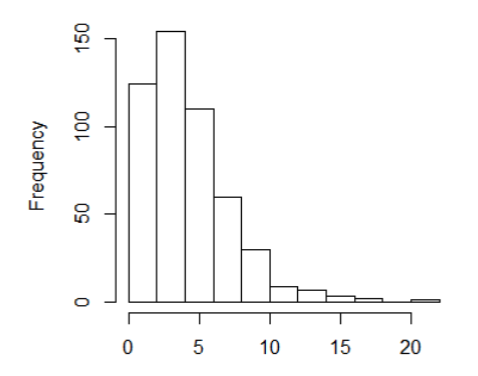 <br><br>
	(2) 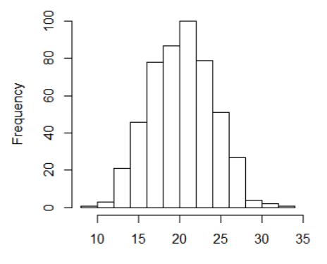 <br><br>
	(3) 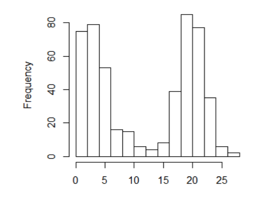 <br><br>
	(4) 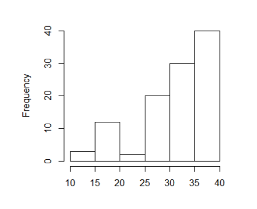 <br><br>

	**Begriffe**

	(a) Rechtsschief
	(b) Linksschief
	(c) Multimodal
	(d) Unimodal
	(e) Rechtssteil
	(f) $\bar{x} > \tilde{x}$
	(g) $\bar{x} \approx \tilde{x}$
:::

::: {.callout-tip collapse="true" title="Lösung"}
(a)

| Histogramm | Begriffe | Beschreibung |
|:----------:|----------|--------------|
| 1 | **b, e, f** | rechtsschief, unimodal, $\bar{x} > \tilde{x}$ |
| 2 | **c**       | multimodal |
| 3 | **b, d, e** | linksschief, unimodal, rechtssteil |
| 4 | **d, g**    | unimodal, $\bar{x} \approx \tilde{x}$ |

:::

### Übungen 8 – A3.2

::: {.webex-check .webex-box}
(a) Bestimmen Sie **Median** und **$0.8$-Quantil** für das Merkmal BBS score bei $n=100$ mit folgender Häufigkeitstabelle:
	<br><br>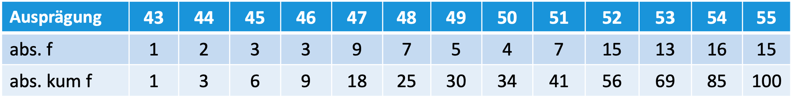 <br><br>
	**Median** $(\tilde{x}_{0.5})=$ `r fitb(52, num = TRUE)`

	**0.8-Quantil** $(\tilde{x}_{0.8})=$ `r fitb(54, num = TRUE)`
:::

::: {.callout-tip collapse="true" title="Lösung"}
(a) Median = $0.5$-Quantil:

	$$
	0.5 \cdot 100 = 50
	$$

	Da dies eine ganze Zahl ist, gilt:

	$$
	\tilde{x} = \frac{x_{(50)} + x_{(51)}}{2}
	$$

	Aus den kumulativen Häufigkeiten liegt sowohl der 50. als auch der 51. Wert bei 52, also:

	$$
		\textbf{Median}(\tilde{x}_{0.5}) = 52
	$$

	Für das $0.8$-Quantil:

	$$
	0.8 \cdot 100 = 80
	$$

	Da auch dies eine ganze Zahl ist, gilt:

	$$
	\tilde{x}_{0.8} = \frac{x_{(80)} + x_{(81)}}{2}
	$$

	Beide Werte liegen bei 54, also:

	$$
	\textbf{0.8-Quantil} (\tilde{x}_{0.8}) = 54
$$

<br><br>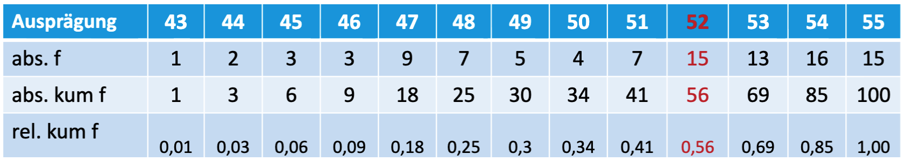 <br><br>
:::

### Übungen 8 – A3.3

::: {.webex-check .webex-box}
(a) Bei einem Boxplot der **BMI-Verteilung** von $n=21$ Probanden sollen folgende **Kennwerte** abgelesen werden: <br><br>
	**BMI-Verteilung:**
	<br><br>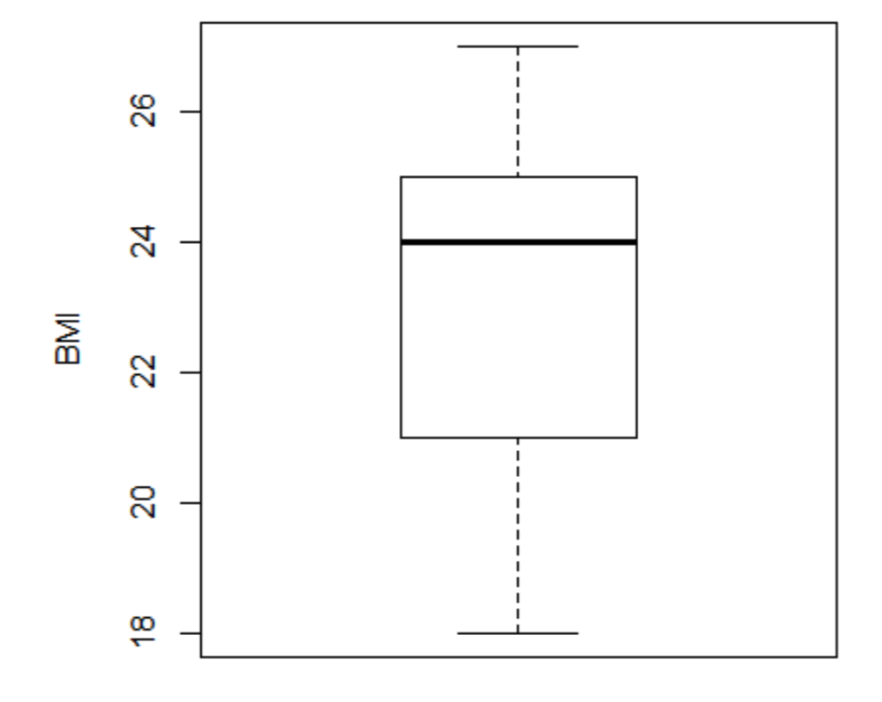 <br><br>
**Kennwerte:**

	| Kennwert | Wert |
	|----------|------|
	| Median   | `r fitb(24, num = TRUE)` |
	| Q1       | `r fitb(21, num = TRUE)` |
	| Q3       | `r fitb(25, num = TRUE)` |
	| IQA      | `r fitb(4, num = TRUE)`  |
	| Range    | `r fitb(9, num = TRUE)`  |

:::

::: {.callout-tip collapse="true" title="Lösung"}
(a) <br>
	- Median $= 24$
	- $Q1 = 21$
	- $Q3 = 25$
	- IQA $= Q3 - Q1 = 4$
	- Range $= 27 - 18 = 9$
:::

## Korrelation, Lineare Regression

### Übungen 8 – A4.1

Gegeben ist folgende Kovarianzmatrix (n=100): <br><br>
	$$\begin{pmatrix}
	S_{x}^{2} & S_{xy} \\
	S_{xy} & S_{y}^{2}
	\end{pmatrix}
	=
	\begin{pmatrix}
	7.6 & 4.5 \\
	4.5 & 3.4
	\end{pmatrix}
	$$

::: {.webex-check .webex-box}
(a) Berechnen Sie den Korrelationskoeffizienten. Geben Sie das Ergebnis mit zwei Nachkommastellen an. <br>
	```{r, results='asis', echo = FALSE}

	cat("Korrelationskoeffizient $=$ ", fitb("0.88", num = TRUE))
	```
:::

::: {.callout-tip collapse="true" title="Lösung"}
(a) Gegeben ist die Kovarianzmatrix

	$$\begin{pmatrix}
	7.6 & 4.5 \\
	4.5 & 3.4
	\end{pmatrix}
	$$

	Der Korrelationskoeffizient ist

	$$
	r_{xy} = \frac{4.5}{\sqrt{7.6 \cdot 3.4}} = 0.88
	$$
:::


::: {.webex-check .webex-box}
```{r, results='asis', echo=FALSE}
opts <- c(
    "Kein Zusammenhang",
    "Niedriger positiver Zusammenhang",
    answer = "Hoher positiver Zusammenhang",
		"Hoher negativer Zusammenhang"
)
cat("(b) Wie interpretieren Sie das Ergebnis?", longmcq(opts))
```
:::

::: {.callout-tip collapse="true" title="Lösung"}
(b) Interpretation: hoher positiver Zusammenhang.
:::

### Übungen 8 – A4.2

### Übungen – A4.2 Rangkorrelation

::: {.webex-check .webex-box}
(a) Gegeben sind folgende Messwerte von $n = 8$ Patienten:

	- Merkmal $X$ = TUG [s]
	- Merkmal $Y$ = FES-I-Score

	**Notiz:** Merkmale sind mind. ordinalskaliert.
	<br>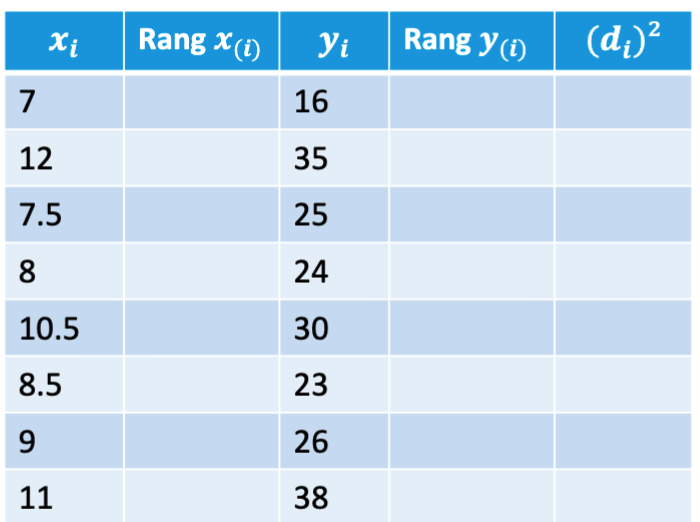 <br><br>

	**Schritt 1:** Vergeben Sie die Ränge für $x_i$ und $y_i$.

	| $x_i$ | Rang $x_{(i)}$ | $y_i$ | Rang $y_{(i)}$ |
	|--------|----------------|--------|----------------|
	| 7      | `r fitb(1)`    | 16     | `r fitb(1)`    |
	| 12     | `r fitb(8)`    | 35     | `r fitb(7)`    |
	| 7.5    | `r fitb(2)`    | 25     | `r fitb(4)`    |
	| 8      | `r fitb(3)`    | 24     | `r fitb(3)`    |
	| 10.5   | `r fitb(6)`    | 30     | `r fitb(6)`    |
	| 8.5    | `r fitb(4)`    | 23     | `r fitb(2)`    |
	| 9      | `r fitb(5)`    | 26     | `r fitb(5)`    |
	| 11     | `r fitb(7)`    | 38     | `r fitb(8)`    |

	<br><br>**Schritt 2:** Berechnen Sie $(d_i)^2 = (\text{Rang}\, x_i - \text{Rang}\, y_i)^2$ für jede Zeile.

	| $x_i$ | Rang $x_{(i)}$ | $y_i$ | Rang $y_{(i)}$ | $(d_i)^2$ |
	|--------|----------------|--------|----------------|-----------|
	| 7      | 1              | 16     | 1              | `r fitb(0)` |
	| 12     | 8              | 35     | 7              | `r fitb(1)` |
	| 7.5    | 2              | 25     | 4              | `r fitb(4)` |
	| 8      | 3              | 24     | 3              | `r fitb(0)` |
	| 10.5   | 6              | 30     | 6              | `r fitb(0)` |
	| 8.5    | 4              | 23     | 2              | `r fitb(4)` |
	| 9      | 5              | 26     | 5              | `r fitb(0)` |
	| 11     | 7              | 38     | 8              | `r fitb(1)` |

	<br><br>**Schritt 3:** Berechnen Sie die Summe $\sum (d_i)^{2} =$ `r fitb(10)`

	**Schritt 4:** Berechnen Sie die Rangkorrelation nach Spearman (Ergebnis auf zwei Nachkommastelle runden):

	$$\rho = 1 - \frac{6 \cdot \sum d_i^2}{n(n^2 - 1)}$$

	$\rho =$ `r fitb(0.88, tol = 0.001)`
:::

::: {.callout-tip collapse="true" title="Lösung"}
(a)
| $x_i$ | Rang $x_{(i)}$ | $y_i$ | Rang $y_{(i)}$ | $(d_i)^2$ |
|--------|----------------|--------|----------------|-----------|
| 7      | 1              | 16     | 1              | 0         |
| 12     | 8              | 35     | 7              | 1         |
| 7.5    | 2              | 25     | 4              | 4         |
| 8      | 3              | 24     | 3              | 0         |
| 10.5   | 6              | 30     | 6              | 0         |
| 8.5    | 4              | 23     | 2              | 4         |
| 9      | 5              | 26     | 5              | 0         |
| 11     | 7              | 38     | 8              | 1         |

	$$\sum (d_i)^2 = 10$$

	$$\rho = 1 - \frac{6 \cdot 10}{8 \cdot (64 - 1)} = 1 - \frac{60}{504} \approx 0.88$$

	Es besteht ein **starker positiver Zusammenhang** zwischen TUG und FES-I-Score.
:::

### Übungen 8 – A4.3

Teriparatide ist ein Medikament, welches die Aktivität in den
Osteoblasten erhöht und somit die Knochenheilung anregt. In
einer klinischen Studie wurde an **$n = 100$** \ Frauen mit
osteoporotischer Beckenfraktur untersucht, ob es einen
Zusammenhang zwischen dem Alter \[Jahren\] und der
Frakturheilung (Zeit \[Wochen\]) gibt unter Gabe von Teriparatide.

:::: {.columns}
<p align="center">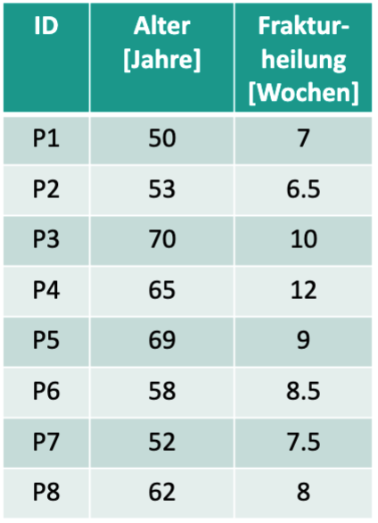</p>

::: {.column width="65%"}
> **Hinweis:** Dies ist nur ein Datenausschnitt, damit Sie dies per Hand rechnen können. 
> Bei $n = 100$ und quantitativen, normalverteilten Merkmalen 
> kann der **Pearson-Korrelationskoeffizient** $r$ berechnet werden. Bei 
> kleinen Stichproben würde man ansonsten eher den 
> **Rangkorrelationskoeffizienten** berechnen.
:::

::: {.webex-check .webex-box}
(a) Untersuchen Sie für diesen Ausschnitt von den Daten den Zusammenhang.

	**Schritt 1:** Welches Skalenniveau haben die Merkmale?

	`r mcq(c("Nominalskaliert", "Ordinalskaliert", answer = "Intervallskaliert", "Verhältnisskaliert"))`

	**Schritt 2:** Berechnen Sie die Mittelwerte (Ergebnis auf eine Nachkommastelle runden).

	$\bar{x} =$ `r fitb(59.9, tol = 0.05)` &nbsp; $\bar{y} =$ `r fitb(8.6, tol = 0.05)`

	**Schritt 3:** Berechnen Sie die Standardabweichungen (Ergebnis auf eine Nachkommastelle runden).

	$s_x =$ `r fitb(7.8, tol = 0.05)` &nbsp; $s_y =$ `r fitb(1.8, tol = 0.05)`

	**Schritt 4:** Berechnen Sie die Kovarianz (Ergebnis auf eine Nachkommastelle runden).

	$$s_{xy} = \frac{1}{n-1} \sum_{i=1}^{n}(x_i - \bar{x})(y_i - \bar{y})$$

	$s_{xy} =$ `r fitb(10.4, tol = 0.05)`

	**Schritt 5:** Berechnen Sie den Pearson-Korrelationskoeffizienten (Ergebnis auf zwei Nachkommastelle runden).

	$$r_{xy} = \frac{s_{xy}}{s_x \cdot s_y}$$

	$r_{xy} =$ `r fitb(0.75, tol = 0.01)`
:::

::: {.callout-tip collapse="true" title="Lösung"}

(a) Die Merkmale sind **intervallskaliert** → Pearson-Korrelation wird verwendet.

	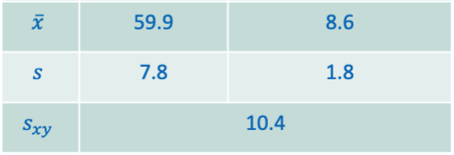 <br>

	$$r_{xy} = \frac{s_{xy}}{s_x \cdot s_y} = \frac{10.4}{7.8 \cdot 1.8} = 0.75$$

	Es besteht ein **starker positiver linearer Zusammenhang** zwischen dem 
	Alter und der Frakturheilungszeit.
:::

### Übungen 8 – A4.4

::: {.webex-check .webex-box}
::: {.column width="65%"}
> Teriparatide ist ein Medikament, welches die Aktivität in den Osteoblasten 
> erhöht und somit die Knochenheilung anregt. In einer klinischen Studie wurde 
> an $n = 100$ Frauen mit osteoporotischer Beckenfraktur untersucht, ob es einen 
> Zusammenhang zwischen dem Alter [Jahren] und der Frakturheilung (Zeit [Wochen]) 
> gibt unter Gabe von Teriparatide.
:::
(a) Wie stellt sich der Zusammenhang dar, wenn man eine Kategorisierung 
	des Alters und der Dauer der Frakturheilung vornimmt?

	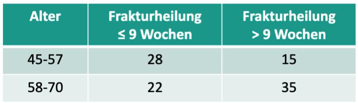 <br><br>
	$\varphi =$ `r fitb(0.26, tol = 0.005)` <br>
<small style="color: gray;">(Ergebnis auf zwei Nachkommastellen runden)</small>
:::

::: {.callout-tip collapse="true" title="Lösung"}

(a) Da beide Merkmale kategorisiert (dichotom) vorliegen, wird der 
	**Vierfelderkoeffizient** $\varphi$ verwendet.

	| Alter | Frakturheilung $\leq 9$ Wochen | Frakturheilung $> 9$ Wochen |
	|-------|:------------------------------:|:---------------------------:|
	| 45–57 | $a = 28$                       | $b = 15$                    |
	| 58–70 | $c = 22$                       | $d = 35$                    |

	$$\varphi = \frac{28 \cdot 35 - 15 \cdot 22}{\sqrt{43 \cdot 57 \cdot 50 \cdot 50}} = \frac{980 - 330}{\sqrt{6\,149\,250}} = \frac{650}{2\,479.8} \approx 0.26$$
:::

### Übungen 8 – A4.5

::: {.webex .webex-box}
(a) Zeichnen Sie eine Gerade ein, die die Daten repräsentiert.<br><br>

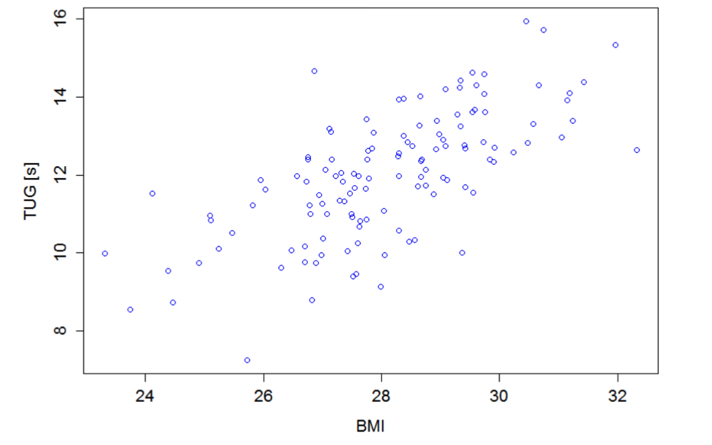
:::

::: {.callout-tip collapse="true" title="Lösung"}
(a)
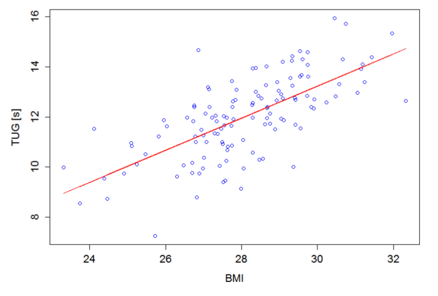
:::

::: {.webex .webex-box}
(b) Bestimmen Sie (Zwei-Punkte Form) die Gleichung dieser Geraden.
:::

::: {.callout-tip collapse="true" title="Lösung"}
(b) **Beispiel** mit den Punkten $(x_1, y_1) = (27;\ 11.4)$ und $(x_2, y_2) = (28;\ 12)$:

	**Steigung:**
	$$m = \frac{12 - 11.4}{28 - 27} = \frac{0.6}{1} = 0.6$$

	**y-Achsenabschnitt:**
	$$b = -0.6 \cdot 27 + 11.4 = -4.8$$

	**Geradengleichung:**
	$$f(x) = 0.6 \cdot x - 4.8$$

	> **Hinweis:** Sie werden wahrscheinlich andere Punkte gewählt haben und 
	> erhalten daher eine leicht abweichende Lösung. Um die **beste** Gerade 
	> für die Daten zu finden, verwendet man die **Methode der kleinsten Quadrate**.
:::

### Übungen 8 – A4.7
Der Zusammenhang zwischen Adiponectin und BMI soll untersucht werden.

**Hintergrund:** Adiponectin stimuliert die Fettsäureoxidation in Muskeln und 
Leber und führt zu einer Verbesserung der Insulinsensitivität. Bei adipösen 
Patienten ist die Plasmakonzentration von Adiponectin erniedrigt. Vermutet wird 
eine **negative Korrelation** mit dem BMI.

Gegeben sind Daten von $n = 10$ Probanden sowie folgende Maße:

$$\bar{x} = 28.6, \quad \bar{y} = 13.7, \quad s_x = 1.51, \quad s_y = 2.19, 
\quad s_{xy} = -2.99$$


::: {.webex .webex-box}

(a) Fertigen Sie eine Punktewolke zu den Daten an. Anschließend bestimmen Sie die Gleichung der Regressionsgerade 
	und zeichnen Sie diese in das Diagramm. <br><br>
	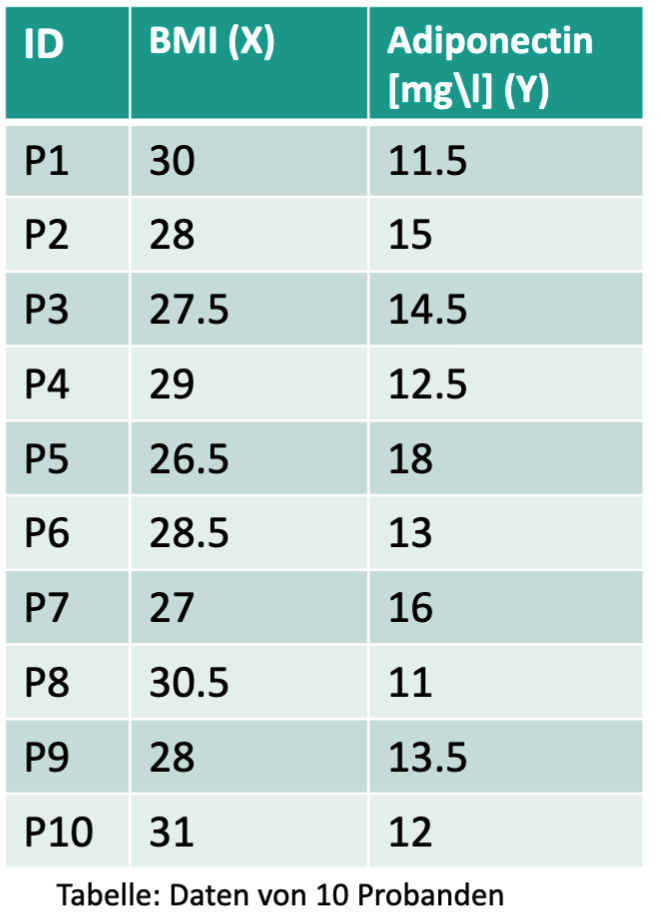
:::

::: {.callout-tip collapse="true" title="Lösung"}
(a)
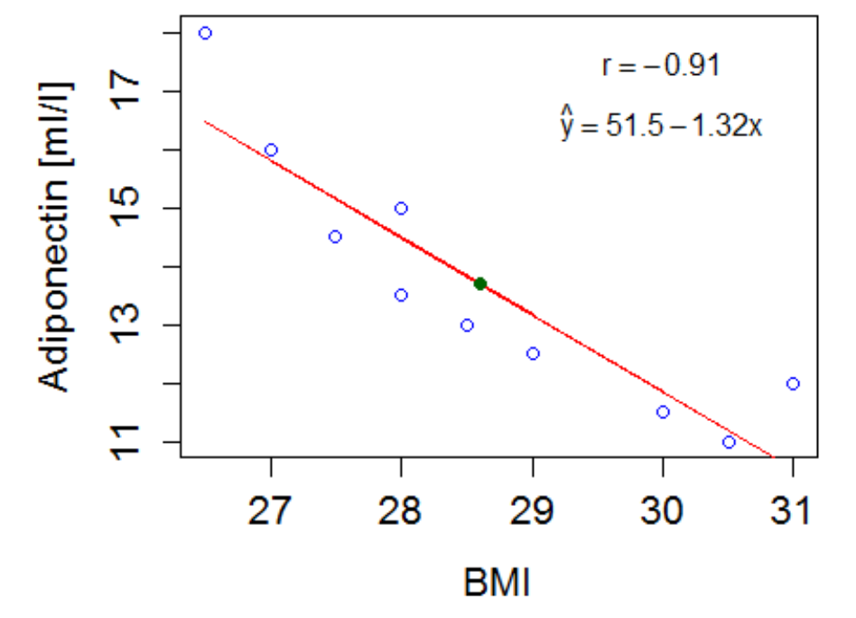 <br><br>
**Regressionsgeraden:**

$$m = \frac{s_{xy}}{s_x^2} = \frac{-2.99}{1.51^2} = -1.31$$

$$b = \bar{y} - m \cdot \bar{x} = 13.7 - (-1.31) \cdot 28.6 = 51.2$$

> Notiz: Mittelwert in allg. Geradengl. einsetzen und b bestimmen
> $\Rightarrow y =  m \cdot x + b \;\;\text{d.h.}\;\; b = y - m \cdot x$ Mittelwert liegt auf der Geraden.
:::

::: {.webex-check .webex-box}
(b) Gibt es einen negativen Zusammenhang? Berechnen Sie die 
Korrelation.<br><br>
$r_{xy} =$ `r fitb(-0.904, tol = 0.005)`
:::

::: {.callout-tip collapse="true" title="Lösung"}
(b) **Korrelation:**

	$$r_{xy} = \frac{s_{xy}}{s_x \cdot s_y} = \frac{-2.99}{1.51 \cdot 2.19} = -0.904$$

	$\Rightarrow$ **Starke negative Korrelation** zwischen BMI und Adiponectin.
:::

::: {.webex-check .webex-box}
(c) Bestimmen Sie das Bestimmtheitsmaß und deuten Sie das Ergebnis (Ergebnis auf zwei Nachkommastellen runden).<br><br>
$R^2 =$ `r fitb(0.81, tol = 0.005)`
:::

::: {.callout-tip collapse="true" title="Lösung"}

(c) **Bestimmtheitsmaß:**
	$$R^2 = (-0.904)^2 = 0.81$$

	$\rightarrow$ **82% der Variabilität** der Adiponectin-Werte kann durch den 
	BMI erklärt werden.
:::
