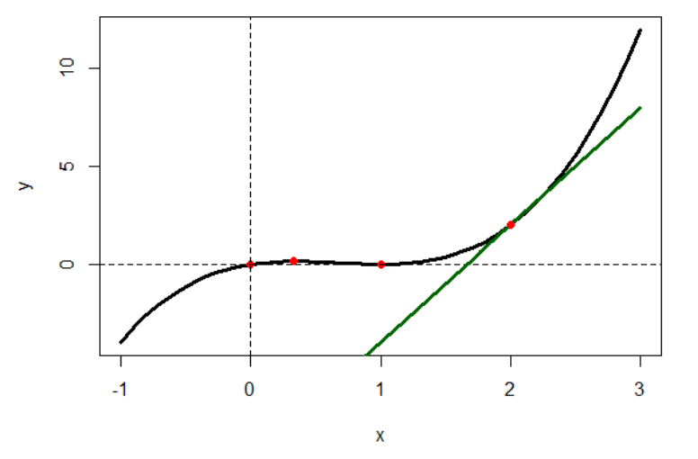
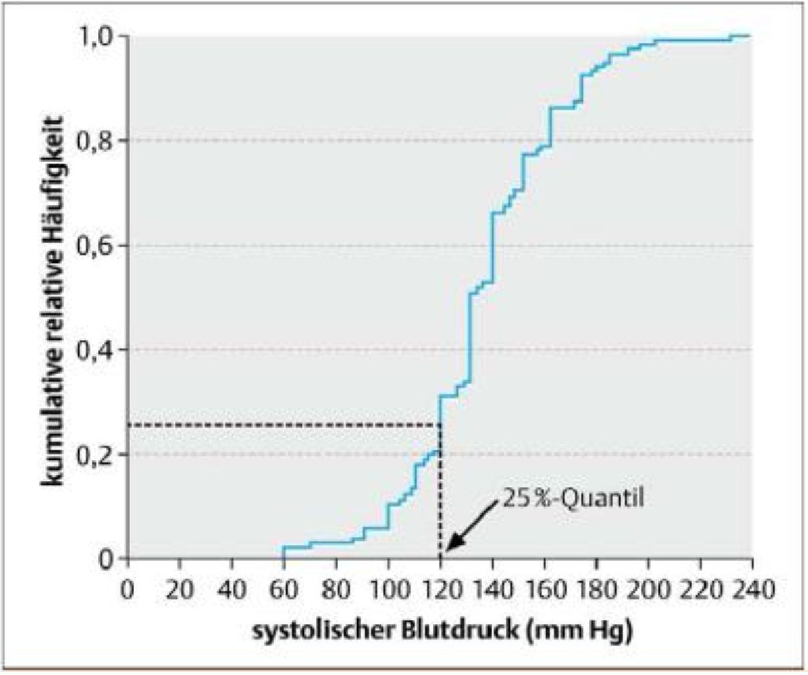
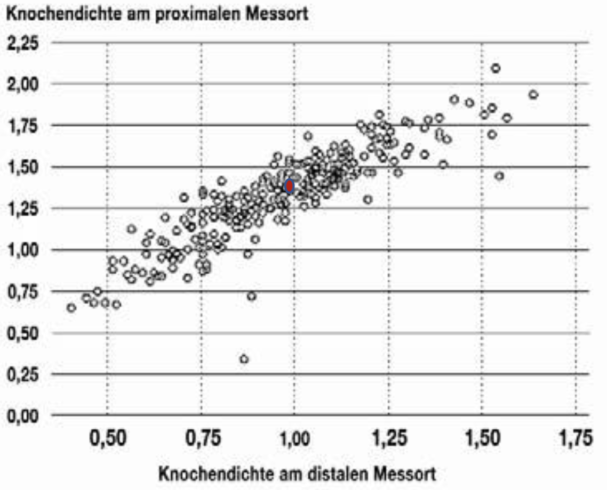

```{r, echo = FALSE, results='asis'}
library(webexercises)
```

Abschlussübung von Block 1 bis Block 5

### Übung 1
Betrachten Sie die Funktion \\(f(x) = (x - 1 )^{2} \\cdot x \\) im Intervall [-1, 3].

::: {.webex-check .webex-box}
```{r, results='asis', echo = FALSE}
opts <- c(
	"$x_{1} = 0, x_{2} = 2$",
	"$x_{1} = -1, x_{2} = 2$",
	answer = "$x_{1} = 1, x_{2} = 0$"
)

cat("(a)  Bestimmen Sie die Nullstellen der Funktion $f(x)$?", longmcq(opts))
```
:::

::: {.callout-tip collapse="true" title="Lösung"}
(a) Die Funktion ist ein Produkt: $f(x) = (x - 1 )^{2} \cdot x = 0$ 

	Ein Produkt ist null, wenn mindestens ein Faktor null ist:

	$(x - 1 )^{2} \Rightarrow x = 1$ (doppelte Nullstelle)

	Nullstellen: $x_{1} = 0,\quad x_{2} = 1$
:::

::: {.webex-check .webex-box}
```{r, results='asis', echo = FALSE}
opts <- c(
	"$t(x) = 5x - 2$",
	"$t(x) = 3x - 4$",
	answer = "$t(x) = 5x - 8$"
)

cat("(b) Bestimmen Sie die Tangente im Punkt $x_{0} = 2$ und zeichnen
	Sie die Tangente ein?", longmcq(opts))
```
:::

::: {.callout-tip collapse="true" title="Lösung"}
(b) Tangente bei $x_{0} = 2$

	Zuerst die Funktion ausmultiplizieren:

	$$
	f(x) = (x^2 - 2x + 1)\cdot x = x^{3} - 2x^{2} + x
	$$

	Ableitung:

	$$
	f'(x) = 3x^{2} - 4x + 1
	$$

	Steigung bei $x_{0} = 2$:

	$$
	f'(2) = 3\cdot 4 - 4\cdot 2 + 1 = 12 - 8 + 1 = 5
	$$

	Funktionswert bei $x_{0} = 2$:

	$$
	f(2) = (2 - 1)^2 \cdot 2 = 1 \cdot 2 = 2
	$$

	Tangentengleichung in Punkt-Steigungs-Form:
	$$
	t(x) = f'(2)(x - 2) + f(2)
	$$

	$$
	t(x) = 5(x - 2) + 2
	$$

	$$
	t(x) = 5x - 10 + 2
	$$

	$$
	t(x) = 5x - 8
	$$

:::

::: {.webex-check .webex-box}
```{r, results='asis', echo = FALSE}
opts <- c(
  "$x_{1} = -1$ und $x_{2} = 3$",
  "Keine Extremstellen im Intervall",
  answer = "$x_{1} = 1$ und $x_{2} = \\frac{1}{3}$"
)

cat("(c) Bestimmen Sie die Extremstellen im Intervall $[-1,3]$", longmcq(opts))
```
:::

::: {.callout-tip collapse="true" title="Lösung"}
(c)
Notwendige Bedingung für Extremstellen:

	$$
	f'(x)=0
	$$

	Da $f'(x)=3x^2-4x+1$ gilt:

	$$
	3x^2-4x+1=0
	$$

	Mit der Mitternachtsformel erhält man:

	$$
	x=\frac{4\pm\sqrt{16-12}}{6}
	$$

	$$
	x=\frac{4\pm\sqrt{4}}{6}
	$$

	$$
	x=\frac{4\pm2}{6}
	$$

	Damit folgen die beiden Lösungen:
	$$
	x_{1} = 1
	\quad \text{und} \quad
	x_{2} = \frac{1}{3}
	$$

	Eingesetzt in die Funktion $f(x)$ ergibt sich für die Extremstellen und am Rand: 
	$$
	f(-1) = -4
	$$
	$$
	f(\frac{1}{3}) = \frac{4}{27}
	$$
	$$
	f(1) = 0
	$$
	$$
	f(3) = 12
	$$

	Daraus lässt sich ablesen, dass die absoluten Extremwerte am Rand liegen. Da
	ein Polynom vom Grad 3 entweder zwei Extremwerte oder eine Wendestelle
	besitzt, sind die inneren Punkte auch lokale Extremwerte.
:::


::: {.webex .webex-box}
(d) Skizzieren Sie die Funktion auf dem Intervall $[-1,3]$
:::

::: {.callout-tip collapse="true" title="Lösung"}
(d)
 <br>
:::

::: {.webex-check .webex-box}
```{r, results='asis', echo = FALSE}
opts <- c(
	"$-1.5$",
	"$2$",
	answer = "$1.5$"
)

cat("(e) Berechnen Sie die Fläche unter der Kurve im Intervall $[-1,1]$", longmcq(opts))
```
:::

::: {.callout-tip collapse="true" title="Lösung"}
(e) Gesucht ist die Fläche unter der Kurve im Intervall $[-1,1]$.

	Da die Funktion im Intervall $[-1,0]$ unter der $x$-Achse und im Intervall $[0,1]$ 
	über der $x$-Achse liegt, wird die Fläche in zwei Teilflächen zerlegt:

	$$
	A = \left| \int_{-1}^{0} (x^3 - 2x^2 + x)\,dx \right|
	+ \left| \int_{0}^{1} (x^3 - 2x^2 + x)\,dx \right|
	$$

	Eine Stammfunktion ist:

	$$
	F(x) = \frac{1}{4}x^4 - \frac{2}{3}x^3 + \frac{1}{2}x^2
	$$

	Damit ergibt sich:

	$$
	A =
	\left|
	\left(
	\frac{1}{4}x^4 - \frac{2}{3}x^3 + \frac{1}{2}x^2
	\right)\Big|_{-1}^{0}
	\right|
	+
	\left|
	\left(
	\frac{1}{4}x^4 - \frac{2}{3}x^3 + \frac{1}{2}x^2
	\right)\Big|_{0}^{1}
	\right|
	$$

	Also:

	$$
	A=
	\left|
	0-\left(\frac{1}{4}+\frac{2}{3}+\frac{1}{2}\right)
	\right|
	+
	\left|
	\left(\frac{1}{4}-\frac{2}{3}+\frac{1}{2}\right)-0
	\right|
	$$

	$$
	A=1.5
$$
:::

### Übungen 2 – (Mengen)

Gegeben sind folgende Mengen $A = \{1,4,7,9,11\} \;\; \text{und} \;\; B = \{1,4,6,9\}$

::: {.webex-check .webex-box}
```{r, results='asis', echo=FALSE}
cat("(a) Bestimmen Sie $A \\cup B = \\{$", fitb("1, 4, 6, 7, 9, 11", num = TRUE), "$\\}$")
```
:::

::: {.callout-tip collapse="true" title="Lösung"}
(a) $A \cup B = \{1, 4, 6, 7, 9, 11\} \Rightarrow$ Vereinigung (ODER: enthält alle Elemente, die in A oder B vorkommen). 
:::

::: {.webex-check .webex-box}
```{r, results='asis', echo=FALSE}
cat("(b) Bestimmen Sie $A \\cap B = \\{$", fitb("1, 4, 9", num = TRUE), "$\\}$")
```
:::

::: {.callout-tip collapse="true" title="Lösung"}
(b) $A \cup B = \{1, 4, 9\} \Rightarrow$ Vereinigung (UND: enthält nur Elemente, die sowohl A als auch
B haben).
:::


### Übungen 3 – (Ableitung)

Bestimmen Sie die erste Ableitung der folgenden Funktionen


::: {.webex-check .webex-box}
```{r, results='asis', echo = FALSE}
opts <- c(
	"$f^{\\prime}(x) = 6x + e^{4x}$",
	"$f^{\\prime}(x) = 3x^2 + 4e^{4x}$",
	answer = "$f^{\\prime}(x) = 6x + 4e^{4x}$"
)

cat("(a) $f(x) = 3x^{2} + e^{4x}$", longmcq(opts))
```
:::

::: {.callout-tip collapse="true" title="Lösung"}
(a) $f^{\prime}(x) = 6x + 4e^{4x} \Rightarrow$ (Notiz: innere Ableitung von $e^{4x}$ ist $4$).
:::

::: {.webex-check .webex-box}
```{r, results='asis', echo = FALSE}
opts <- c(
	"$f^{\\prime}(x) = 2 + 2(1 - x)$",
	answer = "$f^{\\prime}(x) = 0 + 2 \\cdot x$",
	"$f^{\\prime}(x) = 2 + (1 - x)^{2}$"
)

cat("(b) $f(x) = 2 \\cdot x + (1 - x)^{2}$", longmcq(opts))
```
:::

::: {.callout-tip collapse="true" title="Lösung"}
(b) $f^{\prime}(x) = 2 - 2 \cdot (1 - x) = 0 + 2 \cdot x \Rightarrow$ (Notiz: innere Ableitung von $(1 - x)^{2}$ ist $-1$)
:::

::: {.webex-check .webex-box}
```{r, results='asis', echo = FALSE}
opts <- c(
	answer = "$f^{\\prime}(x) = -1/x^{2}$",
	"$f^{\\prime}(x) = \\frac{1}{x^{2}}$",
	"$f^{\\prime}(x) = -\\frac{1}{x}$"
)

cat("(c) $f(x) = \\frac{1}{x} + 2$", longmcq(opts))
```
:::

::: {.callout-tip collapse="true" title="Lösung"}
(c) $f(x) = \frac{1}{x} + 2 \Rightarrow$ (Notiz: $\frac{1}{x} = x^{-1}$)
:::


### Übungen 4 – (Ableitung, Integral)

Gegeben ist die Funktion $f(x) = 2 \cdot x + 2$

::: {.webex-check .webex-box}
```{r, results='asis', echo=FALSE}
cat("(a) Bestimmen Sie die Nullstellen der Funktion. <br> $x =$ ", fitb("-1", num = TRUE))
```
:::

::: {.callout-tip collapse="true" title="Lösung"}
(a) $f(x) = 0$ <br>
	$\Leftrightarrow 2 \cdot x + 2 = 0$ <br>
	$\Leftrightarrow 2x = -2$ <br>
	$\Leftrightarrow x = -1$
:::


::: {.webex-check .webex-box}
```{r, results='asis', echo = FALSE}
opts <- c(
	answer = "$f^{\\prime}(x) = 2$",
	"$f^{\\prime}(x) = 2x$",
	"$f^{\\prime}(x) = x + 2$"
)

cat("(b) Bestimmen Sie die erste Ableitung der Funktion.", longmcq(opts))
```
:::

::: {.callout-tip collapse="true" title="Lösung"}
(b) $f(x) = \frac{1}{x} + 2 \Rightarrow$ (Notiz: $\frac{1}{x} = x^{-1}$)
:::


::: {.webex .webex-box}
(c) Bestimmen Sie die Fläche unterhalb der Funktion für $-2 \leq x \leq 4$.
:::

::: {.callout-tip collapse="true" title="Lösung"}
(c) Die Stammfunktion ist $F(x)=x^2+2x$.

	Die Nullstelle hatten wir bestimmt mit $x=-1$.

	Bestimmung der Fläche: Addiere die Fläche für $-2 \leq x \leq -1$ und für $-1 \leq x \leq 4$.

	1. $\int_{-2}^{-1} (2x + 2)dx = x^{2} + 2x \mid_{x = -2}^{-1}$ <br> <br>
	$= F(-1) - F(-2) = (1 - 2) - (4 - 4) = -1$ <br>
	$\Rightarrow$ Betrag davon ist dann $\left|\int_{-2}^{-1} (2x+2)\,dx\right| = 1$ <br> <br>
	2. $\int_{-1}^{4} (2x +2)\,dx = x^2+2x \mid_{x=-1}^{x=4}$ <br>
	$= F(4)-F(-1) = (16+8)-(1-2) = 25$

	$\Rightarrow$ Somit ist die Fläche $= 1 + 25 = 26$
:::

### Übungen 5 – (Exponentialfunktion)

In einem Forschungsinstitut wird der Einfluss der Umgebungstemperatur auf das Wachstum
von Pflanzen untersucht. Die Temperatur ändert sich gemäß der Funktion $f(t) = 6t \cdot e^{1 - 0.5t}$ 
(t = Zeit in Tagen).

::: {.webex .webex-box}
(a) Bestimmen Sie $f(2)$. <br>
	$f(2) =$ `r fitb(12, num = TRUE)`
:::


::: {.webex .webex-box}
(b) Wann ist die maximale Temperatur erreicht?

	**Schritt 1:** Bestimmen Sie die erste Ableitung $f'(t)$ mit der Produktregel 
	($u' \cdot v + u \cdot v'$).

	$$f'(t) = \, $$ `r mcq(c(answer = "(6 − 3t) · e^(1−0.5t)", "6 · e^(1−0.5t)", "(6 + 3t) · e^(1−0.5t)", "−3t · e^(1−0.5t)"))`

	**Schritt 2:** Setzen Sie $f'(t) = 0$ und lösen Sie nach $t$ auf.

	$t =$ `r fitb(2, num = TRUE)`

	**Schritt 3:** Die maximale Temperatur ist erreicht nach `r fitb(2, num = TRUE)` 
	Tagen und beträgt `r fitb(12, num = TRUE)` °C.
:::

::: {.callout-tip collapse="true" title="Lösung"}

**(a)**

$$f(2) = 6 \cdot 2 \cdot e^{1-0.5 \cdot 2} = 12 \cdot e^{0} = 12 \quad 
(\text{Notiz: } e^0 = 1)$$

**(b)**

**1. Ableitung** (Produktregel: $u = 6t,\ v = e^{1-0.5t}$):

$$f'(t) = 6 \cdot e^{1-0.5t} + 6t \cdot e^{1-0.5t} \cdot (-0.5) = 
(6 - 3t) \cdot e^{1-0.5t}$$

**2. Extremstelle** ($f'(t) = 0$):

$$0 = (6 - 3t) \cdot e^{1-0.5t}$$

Da $e^{1-0.5t} \neq 0$, folgt:

$$0 = 6 - 3t \implies t = 2$$

$\Rightarrow$ Nach **2 Tagen** ist die maximale Temperatur von **12°C** erreicht.

:::

### Übungen 6 – (Vektor, Matrix)
Gegeben sind <br> <br>
$A=\begin{pmatrix} 1 & x & 1 \\ 2 & 3 & z \\ 5 & 7 & y \end{pmatrix}$,
$C=\begin{pmatrix} 2 & 3 \\ 4 & 1 \end{pmatrix}$,
$x=\begin{pmatrix} 0 \\ 2 \\ -1 \end{pmatrix}$,
$D=\begin{pmatrix} 1 & 0 \\ -1 & 1 \end{pmatrix}$

::: {.webex .webex-box}
(a) Berechnen Sie: $A \cdot x$, $A^{T}$ sowie $det(C)$.
:::

::: {.callout-tip collapse="true" title="Lösung"}
(a)

$$
A \cdot x =
\begin{pmatrix} 1 & x & 1 \\ 2 & 3 & z \\ 5 & 7 & y \end{pmatrix}
\cdot
\begin{pmatrix} 0 \\ 2 \\ -1 \end{pmatrix}
=
\begin{pmatrix} 0 + 2x - 1 \\ 0 + 6 - z \\ 0 + 14 - y \end{pmatrix}
=
\begin{pmatrix} 2x - 1 \\ 6 - z \\ 14 - y \end{pmatrix}
$$

$$
A^{T} =
\begin{pmatrix} 1 & 2 & 5 \\ x & 3 & 7 \\ 1 & z & y \end{pmatrix}
$$

$$
det(C) = 2 \cdot 1 - 3 \cdot 4 = 2 - 12 = -10
$$
:::

::: {.webex-check .webex-box}
```{r, results='asis', echo = FALSE}
opts <- c(
	answer = "Nein",
	"Ja"
)

cat("(b) Ist die Matrix $C$ symmetrisch?", longmcq(opts))
```
:::

::: {.callout-tip collapse="true" title="Lösung"}
(b) Nein, da $C \neq C^{T}$.
:::

::: {.webex .webex-box}
(c) Berechnen Sie $E = C + D$.
:::

::: {.callout-tip collapse="true" title="Lösung"}
(c)

$$
E = C + D =
\begin{pmatrix} 2 & 3 \\ 4 & 1 \end{pmatrix}
+
\begin{pmatrix} 1 & 0 \\ -1 & 1 \end{pmatrix}
=
\begin{pmatrix} 3 & 3 \\ 3 & 2 \end{pmatrix}
$$
:::

::: {.webex .webex-box}
(d) Berechnen Sie $F = D \cdot C$.
:::

::: {.callout-tip collapse="true" title="Lösung"}
(d)

$$
F = D \cdot C =
\begin{pmatrix} 1 & 0 \\ -1 & 1 \end{pmatrix}
\cdot
\begin{pmatrix} 2 & 3 \\ 4 & 1 \end{pmatrix}
=
\begin{pmatrix} 2 & 3 \\ 2 & -2 \end{pmatrix}
$$
:::

### Übungen 7 – (Matrix)

Gegeben ist das Gleichungssystem

$$
3x + y + 2z = 3
$$
$$
2x - y + z = 1
$$
$$
4x - 2y + 2z = 2
$$

::: {.webex .webex-box}
(a) Hat das Gleichungssystem eine Lösung? Falls ja, wie viele Lösungen hat dieses Gleichungssystem?
:::

::: {.callout-tip collapse="true" title="Lösung"}
(a) Betrachte die erweiterte Matrix:

$$
\left(
\begin{array}{ccc|c}
3 & 1 & 2 & 3 \\
2 & -1 & 1 & 1 \\
4 & -2 & 2 & 2
\end{array}
\right)
\sim
\left(
\begin{array}{ccc|c}
3 & 1 & 2 & 3 \\
2 & -1 & 1 & 1 \\
0 & 0 & 0 & 0
\end{array}
\right)
$$

Die dritte Zeile ist also abhängig. Damit gilt: Es existiert mindestens eine Lösung, aber keine eindeutige Lösung. Das Gleichungssystem hat unendlich viele Lösungen, weil eine Variable frei wählbar ist.
:::

### Übungen 8 – (Deskription, Einführung)

Bei der Neuaufnahme ins Krankenhaus wird der Blutdruck eines Patienten gemessen.
Welche der folgenden Aussagen ist/sind richtig?

(1) Die Krankenschwester, die den Blutdruck misst, ist der Merkmalsträger.

(2) Der Blutdruck ist das interessierende Merkmal.

(3) Der Patient ist der Merkmalsträger.

(4) Das Krankenhaus ist die Grundgesamtheit.

::: {.webex-check .webex-box}
```{r, results='asis', echo = FALSE}
opts <- c(
	"nur 1 und 4 sind richtig",
	answer = "nur 2 und 3 sind richtig",
	"nur 2 ist richtig"
)

cat("(a) Welche Aussage ist korrekt?", longmcq(opts))
```
:::

::: {.callout-tip collapse="true" title="Lösung"}
(a) Es sind nur (2) und (3) richtig.
:::

### Übungen 9 – (Deskription)

 <br><br>
Abbildung: Empirische Verteilungsfunktion der systolischen Blutdruckwerte von 150 Patienten mit akutem Myokardinfarkt zum Zeitpunkt der Krankenhausaufnahme (Lange & Bender. Dtsch Med Wochenschr 2007; 132:e3-e4). <br><br>

::: {.webex-check .webex-box}
```{r, results='asis', echo = FALSE}
cat("(a) Bestimmen Sie das 50 \\% Quantil (ungefähr): ", fitb("135", num = TRUE))
```
:::

::: {.callout-tip collapse="true" title="Lösung"}
(a) 50\%-Quantil = Median = 135
:::

::: {.webex .webex-box}
(b) Basierend auf der empirischen Verteilungsfunktion, skizzieren Sie einen Boxplot zu diesen Daten.
:::

::: {.callout-tip collapse="true" title="Lösung"}
(b) $25\%$-Quantil $= 120$, $50\%$-Quantil $= 135$, $75\%$-Quantil $= 155$, Min $= 60$, Max $= 240$. Basierend auf diesen Werten kann der Boxplot gezeichnet werden.
:::

### Übungen 10 – (Regression)
 <br><br>
Abbildung: Knochendichte am proximalen vs distalen Messort (Spriestersbach et al. Dtsch Ärzteblatt 2009; 106(36): 578-583).

::: {.webex .webex-box}
(a) Zeichnen Sie den Schwerpunkt der Punktewolke ein: $(\bar{x}, \bar{y}) = (1,1.35)$
:::

::: {.webex .webex-box}
(b) Neben $(\bar{x}, \bar{y})$ liegt noch der Punkt $(0.5,0.75)$ auf der Regressionsgeraden. Bestimmen Sie die Gleichung der Regressionsgeraden.
:::

::: {.callout-tip collapse="true" title="Lösung"}
(b) Mit $y = mx + b$ gilt:

	$$
	m = \frac{1.35 - 0.75}{1 - 0.5} = 1.2
	$$

	$$
	b = 1.35 - 1.2 \cdot 1 = 0.15
	$$

	Damit lautet die Regressionsgerade:

	$$
	y = 1.2x + 0.15
	$$
:::

::: {.webex-check .webex-box}
```{r, results='asis', echo = FALSE}
cat("(c) Welche Knochendichte am proximalen Messort würden Sie vorhersagen bei einer Knochendichte am distalen Messort von 1.5? ", fitb("1.95", num = TRUE))
```
:::

::: {.callout-tip collapse="true" title="Lösung"}
(c) $x = 1.5$ in die Regressionsgerade eingesetzt ergibt:

	$$
	y = 1.2 \cdot 1.5 + 0.15 = 1.95
	$$

	Es wird also eine Knochendichte am proximalen Messort von $1.95$ vorhergesagt.
:::

::: {.webex-check .webex-box}
```{r, results='asis', echo = FALSE}
cat("(d) Wie lautet der Regressionskoeffizient? ", fitb("0.86", num = TRUE), "<br>")
cat("Wie lautet das Bestimmtheitsmaß? ", fitb("0.74", num = TRUE))
```
:::

::: {.callout-tip collapse="true" title="Lösung"}
(d) Regressionskoeffizient:

	$$
	r = m \cdot \frac{s_x}{s_y} = 1.2 \cdot \frac{0.5}{0.7} = 0.86
	$$

	Bestimmtheitsmaß:

	$$
	R^2 = 0.86^2 = 0.74
	$$
:::
